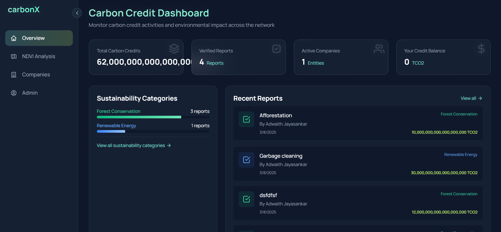
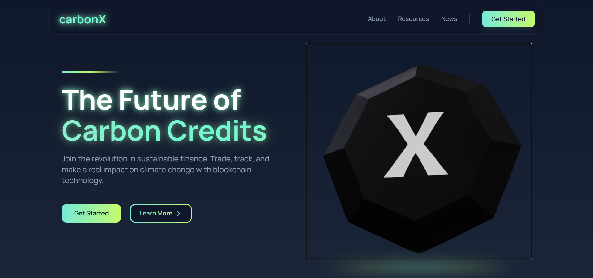
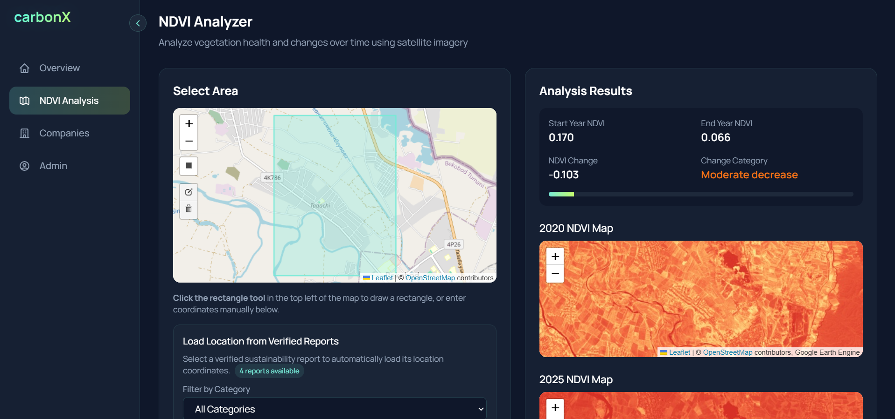
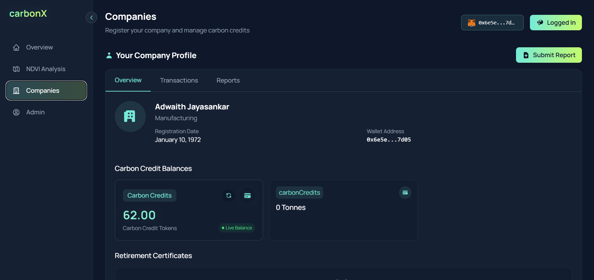
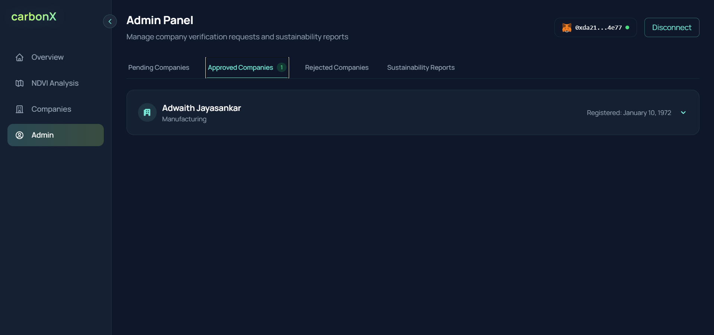

# CarbonX - Blockchain-Based Carbon Credit Platform

## 🚀 Project Description
CarbonX is an innovative blockchain-based platform designed to revolutionize carbon credit verification, tracking, and trading. The platform empowers companies to register sustainability initiatives, submit verifiable environmental reports, and receive carbon credits through a transparent blockchain system. It features advanced NDVI (Normalized Difference Vegetation Index) analysis for scientifically validating environmental impact using satellite imagery.

## 🎯 Link to Project
[CarbonX Live Demo](https://carbonx-iota.vercel.app/)

## 🛠 Tech Stack
- **Frontend**: React.js, Vite, Tailwind CSS, Framer Motion
- **Backend**: Ethereum Smart Contracts, Solidity
- **Data Analysis**: NDVI Satellite Imagery Processing
- **Libraries**: Leaflet (for mapping), Web3.js (for blockchain integration)
- **Deployment**: Vercel

## 📦 Prerequisites
- Node.js (v16+)
- npm (v8+)
- MetaMask wallet extension for browser
- Internet connection for satellite data access

## 🔧 Installation & Setup

1. Clone the repository
   ```bash
   git clone https://github.com/kichuman28/We_Eat_Blocks.git
   cd We_Eat_Blocks/carbonx
   ```

2. Install dependencies
   ```bash
   npm install
   ```

3. Configure Environment Variables
   
   - Create a `.env` file in the root directory
   - Add necessary configuration details
     
   ```
   VITE_CONTRACT_ADDRESS=your_contract_address
   VITE_SATELLITE_API_KEY=your_satellite_api_key
   ```

4. Run the Application
   ```bash
   npm run dev
   ```

## 🌟 Key Features

### Dashboard Overview

A comprehensive dashboard displaying real-time statistics on carbon credits, verified reports, and active companies. Features dynamic graphs and summaries of sustainability initiatives.

### Landing Page

An engaging landing page that introduces the platform's mission and key features, with clear navigation to all sections of the application.

### NDVI Analyzer

Advanced satellite imagery analysis tool that allows users to select regions and analyze vegetation health over time. The tool supports drawing custom areas on maps and loading coordinates from verified reports.

### Companies Management

A directory of verified companies participating in carbon credit initiatives. Companies can register, submit sustainability reports, and track their environmental impact.

### Administrative Controls

Secure admin panel for verifying companies and reports, minting carbon credit tokens, and maintaining platform integrity through blockchain verification.

## How It Works

1. **Company Registration**: Organizations register on the platform using their blockchain wallet
2. **Report Submission**: Verified companies submit sustainability reports with evidence including geographic coordinates
3. **Scientific Verification**: Reports are verified using blockchain and NDVI analysis
4. **Carbon Credit Tokenization**: Verified environmental actions are tokenized as carbon credits
5. **Transparent Trading**: Credits can be tracked, transferred, and traded with full transparency

## Team Members
  [1. Parthav Povil (Blockchain Developer)](https://github.com/parthavpovil)   
  [2. Abel Davis Boby (Flutter Developer)](https://github.com/Abelboby)   
  [3. Adwaith Jayasankar (Frontend Developer)](https://github.com/kichuman28)   
  [4. Ajith John (AI & ML Developer)](https://github.com/ajithjohn007)  

**Made with ❤️ at Beachhack 6**
